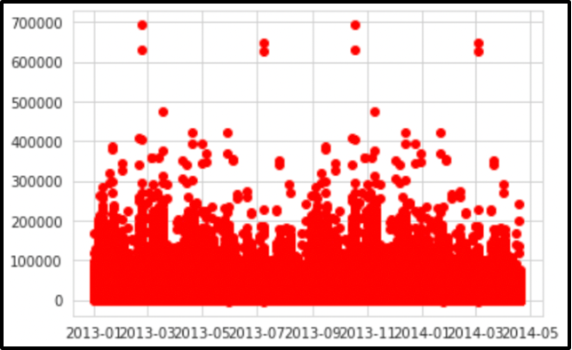
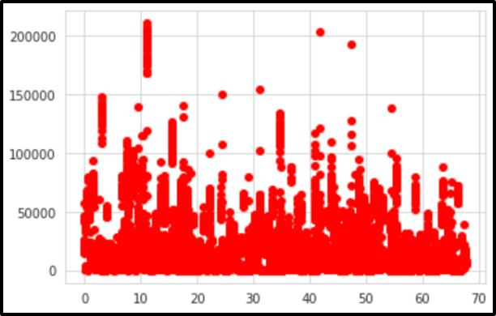
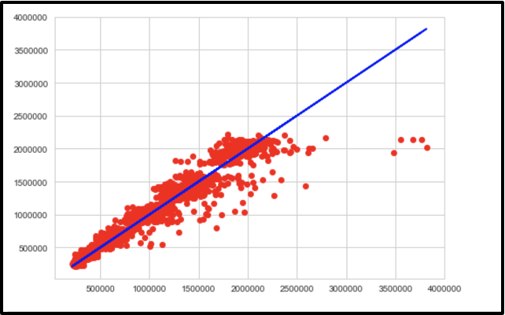
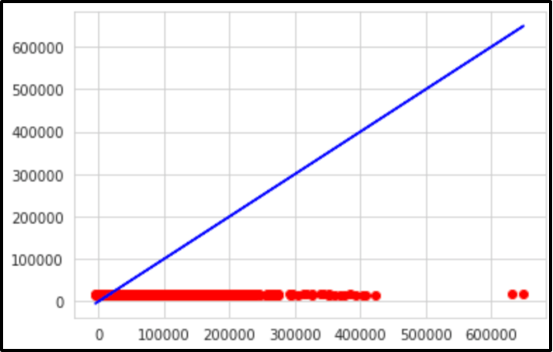

# **Store Sales**
# **Time Series Forecasting**

## <u>**Authors**</u> 

Arisdelsy Bruno Diaz

Johnny Pillacela

Ryan Feroz

## <u>**Abstract**</u>

The problem we are trying to solve is the ability for a shopper to know if it is worth their time to shop at stores during the midst of events. With our prediction model this will be able to take in data and generate a response to aid a decision whether to stay home or make the drive. The data that will be used are in the format of .csv files and our system will run off of Python. The store data will be collected from stores that publicly list their inventory and sales with the addition of data from Google Trends.

Our approach is to predict the sales for each department using historical markdown data from the kaggle dataset containing data of multiple stores. We are developing a predictive model and finding out the sales of each product at a given store from the data. This project features an exploratory analysis and our predictive model was primarily based on linear regression.

We would also like to create a linear model to find a specific value for Weekly Sales that we want to predict. This line of best fit is intended to approximate further data points based on the line that we find in our training data. Perform dimensionality reduction to improve prediction error by shrinkage in order to reduce overfitting.

Based on our results, our findings with what our models have predicted flow in line to what is expected during certain times of the year. With the data files being from local grocery stores and areas in Ecuador, it shows a unique difference in the data showing how it can vary from a regular day as in America. With the culture and what is available makes a huge difference in what certain trends happen to be on certain days. Although with temperature being a close comparison to what would be relevant no matter what part of the world, we can tell trends that on hot days people tend to be indoors more being stores or restaurants.

## **Introduction:**

The problem we will be investigating is in regards to grocery stores not having stock at vital times in the year. With the COVID 19 Epidemic, stores were not able to properly prepare for the shortages and necessary stock to be able to accommodate for such emergencies. This is interesting because even now with there being a shortage of silicon in today&#39;s technology devices, will we ever be able to recover?

We will be looking at this Kaggle Competition (https://www.kaggle.com/c/store-sales-time-series-forecasting) and other store .csv files for data to help us get a background for this problem. We will also be reading about how to create effective prediction models and look at other examples to help formulate the perfect prediction for our store of choice.

We will use data allocated from stores that publicly list their inventory and sales with the addition of data from Google Trends.

Using our data that we collected, we will use Time Series Forecasting to predict sales. This data will be in csv files that will be fed into our algorithm for prediction. This will be done in python.

We will use plot graphs of different time spreads to come up with the best predictions for future sales. We can compare our hypotheses against quantitative data produced by our program to determine error.

- The following graph was generated and shows the Weekly Sales on a spread of two years 
- Shows how sales stay relatively consistent throughout the year but has obvious outliers
- These outliers are were we expect anomalies in current events such as holidays, temperature and more 

- There were several categories of data which meant that in reality we are looking at a multilinear problem
- From sklearn we used train\_test\_split() to train our data
- train\_test\_split() took in stores data
  - We set the test data set to be 30% and the training set to be the remaining 70%
- The plotted data is the result of our prediction model which compared side by side to our first graph we can see it is somewhat similar even while representing different dimensions.

- This graph is the performance on the test data sets 
- The plotted graph shows the representation of the ŷ
- The ŷ represents the predicted equation for a line of best fit in linear regression

- We implemented the Least Squares Regression Line
- This is the line that makes the vertical distance from the data points to the regression line as small as possible
- Gives you an approximation between our variables
- The plotted graph shows the performance on the test data sets
- We used .predict() from sklearn to create data

## **Related Work**

Since this project is based off of a Kaggle Competition, we researched entries from multiple users seeing countless different results. We also have seen other related projects out on the web trying to formulate different prediction models for stores and sales with varying data. Most differences from these projects are the amount of data they have been using and where it has been from. Usually they use grocery store data since there is a plethora of items and information that can be pulled from monthly sales and such. Our work is similar due to the fact that this is a Kaggle Competition where other participants are given the same opportunity and data to work with on their projects. Although the data is the same for everyone, what we pick and choose to formulate results for our model vary with many other different entries.

## **Data**

The data we are working with in our project are .csv files which stand for &quot;comma separated values&quot;. We will use these files to feed into our model to formulate its predictions. They are packed with data that are relevant to our project being sales and transactions for example. The data is coming from the Kaggle Competition itself since obtaining data from other companies can be rather difficult due to it being confidential information. The data is already formatted properly in the csv files; it is just a matter of our program to properly extract the information. We are using train data, test data, store data and features data which were all given by the challenge.

## **Methods**

We looked into time series forecasting to give us a better form of context and background to take on this task. Making sure we also understood the proper libraries that would be needed to program such models and to be able to show our data with graphs and visualizations. This is the proper way of approaching this project due to it being a more efficient way of solving this issue as well as having the perfect tool belt to pick and choose what we need to build our work and to present it. We considered solely researching and studying off the Kaggle Competition and the inspiration from looking at other contestants&#39; entries but we found it was either too vague or very confusing to understand others&#39; work. With our growing knowledge of linear regression and previous exposure to using python libraries to help graph our data, this all was crucial in helping us decide what type of problem we could handle. Python libraries consist of Numpy, Panda, SciPy.

## **Experiments**

Our experiments consisted of using different csv files. Each one yielded different results, this allowed us to test and see if our model actually worked as well as having multiple forms of comparable data for us to reflect and analyze. For example, we used our sales data to formulate graphs. One example of a graph being shown is a time versus daily sales. It allows us to see in a spread of three years the expected sales and time periods where we can expect outliers. These outliers can be explained due to events such as holidays, natural disaster warnings, and even temperature.

## **Conclusion**

In conclusion, what we learned with this project is how effective a prediction model can really be if it is applied correctly to modern day issues. We can take into account the future other events such as unemployment, fuel pricing and temperature of the day. If we were to do this project again we take into consideration several other internal and external factors that can affect store sales such as the amount of employees a year (employment in general), fuel prices and how it affects consumers average purchases, the amount of holidays, the temperature and the region.

## **Citations**

Kaggle Data [https://www.kaggle.com/c/store-sales-time-series-forecasting/data](https://www.kaggle.com/c/store-sales-time-series-forecasting/data)